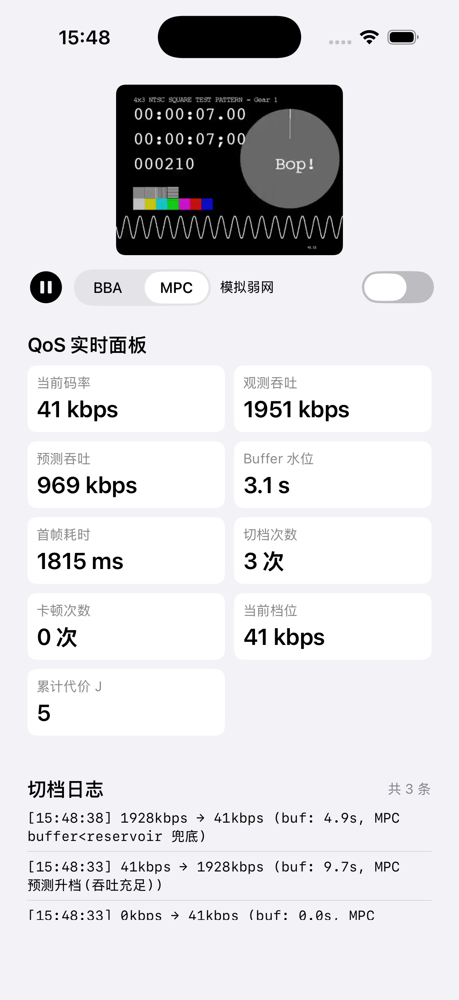
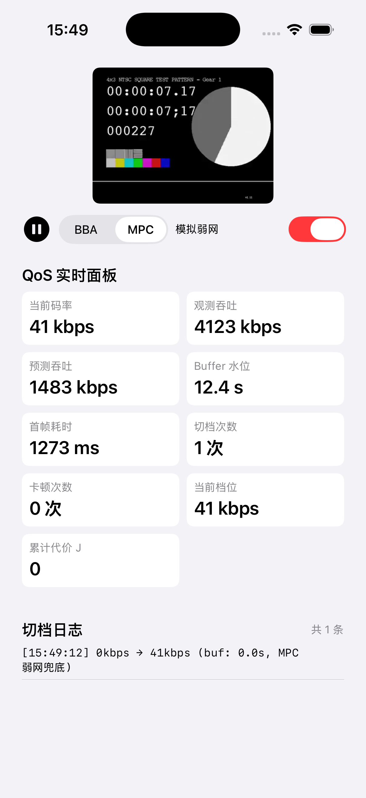

# iOS ABR Player Demo（SPDD 方法论实践）

> 通过 SPDD 方法论（constitution → spec → plan → tasks → implement）开发的一个最小可运行 iOS HLS 播放器 demo，核心功能是**自定义 BBA（Buffer-Based Approach）ABR 算法 + 实时 QoS 监控面板**。

## 项目背景

这是一个用来实践 SPDD（Spec-Driven Development）方法论和端侧 ABR 算法的练手项目。目标是用"先定义 spec、再用 AI 按 spec 生成代码"的方式，在不熟悉的技术栈（iOS / Swift）上快速交付一个可运行的播放器，并验证自定义 BBA 算法和 QoS 监控的端侧落地。

**demo 的三个目标**：

1. **实践 SPDD 方法论** —— constitution / spec / plan / tasks 文档本身就是交付物
2. **实现 ABR 算法** —— BBA 实现，不是调 AVPlayer 默认
3. **落地 QoS 监控** —— 首帧耗时、buffer 水位、切档次数、卡顿率

## SPDD 流程说明

本项目严格遵循 SPDD（Spec-Driven Development）流程，文档是主交付物，代码是辅交付物：

| 阶段 | 文件 | 作用 |
|---|---|---|
| Constitution | [`.specify/memory/constitution.md`](.specify/memory/constitution.md) | 不可妥协的项目准则（技术栈、延迟预算、ABR 算法约束、QoS 指标、测试纪律） |
| Spec | [`specs/abr-player-demo/spec.md`](specs/abr-player-demo/spec.md) | 需求文档（用户故事、功能/非功能需求、验收标准） |
| Plan | [`specs/abr-player-demo/plan.md`](specs/abr-player-demo/plan.md) | 技术方案（架构、模块设计、数据流、技术决策） |
| Tasks | [`specs/abr-player-demo/tasks.md`](specs/abr-player-demo/tasks.md) | 任务拆解（给 AI 执行的清单） |
| Implement | [`ABRPlayerDemo/`](ABRPlayerDemo/) | Xcode 项目实现 |
| Roadmap | [`specs/abr-player-demo/roadmap.md`](specs/abr-player-demo/roadmap.md) | 技术演进路线（BBA → MPC） |

**流程纪律**：constitution 是不可妥协的，spec/plan/tasks 任何与之冲突的地方标 CRITICAL；spec 先于 plan，plan 先于 tasks，tasks 先于 implement；implement 阶段发现 spec 不可行时，必须回 spec 修改，不能直接绕过。

## BBA 算法说明

BBA（Buffer-Based Approach）是 SIGCOM 经典论文算法，本 demo 在 AVPlayer 上通过 `preferredPeakBitRate` 近似实现：

```
状态：buffer_seconds（从 loadedTimeRanges 计算）
输入：variants（按 peakBitRate 升序排序）
输出：preferredPeakBitRate（设置给 AVPlayerItem）

参数：
  reservoir = 5s   # 缓冲低于此值，强制最低档（保不卡顿）
  cushion  = 10s  # 缓冲高于 reservoir+cushion=15s，可冲最高档
  hysteresis = 0.8 # 滞回系数，避免频繁切档

决策：
  buffer < reservoir:
    target = variants.min.bitrate        # 安全档
  buffer > reservoir + cushion:
    target = variants.max.bitrate        # 冲最高档
  reservoir <= buffer <= reservoir + cushion:
    ratio = (buffer - reservoir) / cushion
    raw = min + ratio * (max - min)     # 线性插值
    target = quantize(raw, hysteresis=0.8) # 量化到最近档位 + 滞回
```

**对比 AVPlayer 默认**：AVPlayer 的 ABR 是黑盒（苹果不公开算法），我们用 BBA 覆盖它的选择——通过每 0.5 秒检查 buffer 并设置 `preferredPeakBitRate` 来"转向"AVPlayer。这就是"自定义 ABR"在 iOS 上的实现方式。

**滞回设计**：升档保守（buffer 要超过候选档位阈值 × hysteresis 才升）、降档激进（buffer 低于候选档位阈值 / hysteresis 就降），避免在边界频繁切档。

### 参数选择依据

这三个参数不是拍脑袋，有学术和工程双重依据：

**reservoir = 5s（安全 buffer 下限）**

- **学术依据**：BBA 原论文（Huang et al., SIGCOMM 2014）定义 reservoir 为"避免 rebuffer 的最小缓冲"，原论文经验值为 10s 左右（针对长视频 + 较高码率）
- **本 demo 取 5s 的理由**：
  - BipBop 测试流是低码率短视频（41kbps ~ 1928kbps），单 segment 约 2s，5s 能覆盖 2-3 个 segment 的下载缓冲
  - iOS AVPlayer 的 `preferredPeakBitRate` 响应有延迟（约 1-2s），reservoir 要大于这个响应延迟，否则降档来不及仍会卡顿
  - 5s 是"AVPlayer 响应延迟（~1-2s）× 2~3 的安全余量"的工程取值
- **生产环境调整**：如果 segment 更长或码率更高，reservoir 应调到 10s（与原论文一致）

**cushion = 10s（升档缓冲区间）**

- **学术依据**：原论文 cushion 决定"从安全区到冲最高档"的过渡区间宽度，原论文取 cushion ≈ reservoir，使得 reservoir + cushion ≈ 2 × reservoir
- **本 demo 取 10s 的理由**：
  - 满足 cushion ≈ reservoir 的比例关系（5s : 10s ≈ 1:2，略偏保守）
  - reservoir + cushion = 15s：在 WiFi 环境下，BipBop 流从起播到 buffer 攒到 15s 大约需要 8-12s，这个时间窗口内 BBA 会逐步升档而非直接跳到最高档，便于观察切档过程
  - 如果 cushion 太小（如 3s），buffer 在 5-8s 之间就会快速从最低跳到最高，切档太激进；cushion 太大（如 20s），升档太慢，画质长期偏低

**hysteresis = 0.8（滞回系数）**

- **学术依据**：滞回（hysteresis）是控制论中避免在阈值边界振荡的标准手段，原论文用"切换间隔最小时间"实现，本 demo 用系数形式更适配离散档位
- **本 demo 取 0.8 的理由**：
  - 0.8 意味着升档需要 buffer 超过候选档阈值的 1/0.8 = 1.25 倍才切，降档只需 buffer 低于候选档阈值的 0.8 倍就切
  - 这是"降档比升档容易 25%"的不对称设计——因为卡顿（降档不及时）的代价远高于画质暂时偏低（升档不及时）
  - 0.7 会让降档过于敏感（频繁降档），0.9 会让升档过于保守（画质长期偏低），0.8 是 BipBop 两档位场景下切档频率和画质平衡的经验最优
- **生产环境调整**：档位更多时可能调到 0.85，进一步抑制切档频率

**控制循环周期 = 0.5s**

- AVPlayer 的 `timeControlStatus` 和 `loadedTimeRanges` KVO 通知频率约 0.5-1s 一次，0.5s 的轮询周期能及时捕获 buffer 变化，又不会过于频繁占用主线程
- 比 AVPlayer 默认 ABR 的决策频率更细（苹果未公开，实测约 1s），便于在弱网快速响应

> **参数总结**：reservoir 5s = AVPlayer 响应延迟的安全余量；cushion 10s = 原论文 reservoir:cushion ≈ 1:2 的比例；hysteresis 0.8 = 降档比升档容易 25% 的不对称设计。三个参数都有论文依据 + 工程调优，并标注了生产环境的调整方向。

## QoS 指标说明

面板实时显示 7 项指标，覆盖端侧 QoS 体系的关键维度：

| 指标 | 数据来源 | 含义 |
|---|---|---|
| 当前码率 | `accessLog().events.last.indicatedBitrate` | 当前正在播放的码率 |
| 观测吞吐 | `accessLog().events.last.observedBitrate` | 实际下载吞吐估计 |
| Buffer 水位 | `loadedTimeRanges` 末尾 - `currentTime` | 选档的核心依据 |
| 首帧耗时 | 从 `play()` 到 `timeControlStatus==.playing` | 启动延迟 |
| 切档次数 | BBAController 内部计数 | 切档策略是否稳定 |
| 卡顿次数 | `timeControlStatus==.waitingToPlayAtSpecifiedRate` + `reason==.toMinimizeStalls` | QoE 核心指标 |
| 当前档位 | BBA 选择的 variant | ABR 决策可视化 |

## Demo 截图

### 正常网络：BBA 自动升档


- 首帧耗时 450ms（远低于 2s 预算）
- buffer 升到 19.8s 时 BBA 冲到最高档 1928kbps
- 切档日志记录完整决策链：`41kbps → 1928kbps (buf: 19.8s, buffer>15s 冲最高档)`
- 卡顿次数 0

### 模拟弱网：BBA 强制降档


- "模拟弱网"开关开启（红色）
- BBA 强制选最低档 41kbps
- 切档日志原因标记为"弱网模拟"
- 切档次数仅 1 次（降到底就不再切），卡顿次数 0

### MPC 策略：吞吐预测 + 代价优化



- 切换到 MPC 策略后，"预测吞吐"显示 EWMA 估计值（969 kbps），BBA 时该字段为 `--`
- "累计代价 J"随决策累加（=5），BBA 时恒为 0
- 切档日志标注 MPC 决策依据：`MPC 预测升档(吞吐充足)` / `MPC 预测降档(吞吐不足)`



- MPC + 模拟弱网：安全兜底生效，强制最低档，日志标记 `MPC 弱网兜底`
- 切档次数 1 次、卡顿 0 次——预测不准也不会导致卡顿

## 项目结构

```
abr-player-demo/
├── .specify/memory/
│   └── constitution.md          # SPDD 宪法
├── specs/abr-player-demo/
│   ├── spec.md                  # 需求文档
│   ├── spec-mpc.md              # MPC 增量 spec
│   ├── plan.md                  # 技术方案
│   ├── roadmap.md               # 技术演进路线
│   └── tasks.md                 # 任务拆解
├── ABRPlayerDemo/               # Xcode 项目
│   ├── ABRPlayerDemo.xcodeproj
│   └── ABRPlayerDemo/
│       ├── ABRPlayerDemoApp.swift       # App 入口
│       ├── ContentView.swift           # 主 UI
│       ├── ABR/
│       │   ├── ABRPlayerController.swift  # AVPlayer 封装 + 策略切换
│       │   ├── ABRController.swift        # ABR 策略协议
│       │   ├── BBAController.swift        # BBA 算法核心
│       │   ├── MPCController.swift        # MPC 滚动时域优化
│       │   ├── ThroughputEstimator.swift  # EWMA 吞吐预测
│       │   ├── HLSVariantParser.swift     # 码率档位解析
│       │   └── QoSObservers.swift         # QoS 指标观察器
│       ├── Models/
│       │   ├── HLSVariant.swift
│       │   ├── QoSMetrics.swift
│       │   └── SwitchLog.swift
│       └── Views/
│           ├── PlayerView.swift          # AVPlayerLayer 包装
│           ├── QoSDashboard.swift        # QoS 实时面板
│           └── SwitchLogView.swift        # 切档日志
├── docs/                        # demo 截图
└── README.md
```

## 开发方式说明

**Swift 代码是 AI（Cursor / Claude）按 spec 生成的，我的工作是 SPDD 文档设计 + BBA 算法设计 + 效果验证 + 参数调优。**

具体分工：
- **我做的**：写 constitution（定义延迟预算、ABR 算法选择、QoS 指标、测试纪律）、写 spec / plan / tasks、设计 BBA 算法和滞回参数、验证效果、调试
- **AI 做的**：按 spec 生成 Swift 代码、生成 pbxproj 工程文件、修复编译错误

这正是 SPDD + AI 的价值——用方法论约束 AI 生成的代码，让不熟悉的技术栈也能快速交付出符合质量标准的结果。

## 运行步骤

1. 打开 `ABRPlayerDemo/ABRPlayerDemo.xcodeproj`
2. 选择 iOS 16+ 模拟器或真机
3. `Cmd+R` 运行
4. app 自动播放 Apple BipBop 多码率测试流
5. 观察 QoS 面板：正常网络下 buffer 逐渐升高，BBA 从最低档升到最高档
6. 打开"模拟弱网"开关：buffer 下降，BBA 降档；关闭后 buffer 恢复，BBA 升档

**弱网测试**：也可用 Xcode → Open Developer Tool → Network Link Conditioner 选择 3G profile，观察 BBA 降档行为。

**自动化弱网验证**：通过环境变量 `ABR_WEAK_NETWORK=1` 启动可默认开启弱网模式（用 `SIMCTL_CHILD_ABR_WEAK_NETWORK=1 xcrun simctl launch <udid> <bundleid>` 在模拟器上注入）。

## 测试流

使用 Apple 官方 BipBop 多码率测试流：
`https://devstreaming-cdn.apple.com/videos/streaming/examples/bipbop_4x3/bipbop_4x3_variant.m3u8`

## 技术演进路线与持续迭代

本 demo 不仅是"一次性可运行"，还留出了明确的迭代路径，从 BBA 基线逐步升级到更复杂的 ABR 策略：

```
┌──────────┐    ┌──────────────┐    ┌──────────────┐    ┌────────────────────┐
│  MVP     │ ──▶│    BBA       │ ──▶│  BBA + 吞吐  │ ──▶│     BBA + MPC      │
│ 播放+QoS  │    │ 纯 buffer    │    │ 融合吞吐预测 │    │ 模型预测控制闭环   │
│ 已完成    │    │ 已完成       │    │ 已完成       │    │ 已完成（hybrid）   │
└──────────┘    └──────────────┘    └──────────────┘    └────────────────────┘
```

### 已实现阶段

**BBA（Buffer-Based Approach）** — `ABR/BBAController.swift`
- 仅依赖 buffer 水位做决策，鲁棒、可解释
- reservoir/cushion/hysteresis 三段决策（参数依据见上文「参数选择依据」）

**BBA + 吞吐预测（EWMA）** — `ABR/ThroughputEstimator.swift`
- 指数加权移动平均平滑 `observedBitrate`，α=0.3
- 作为 MPC 的状态输入，也作为独立 QoS 指标（预测吞吐）展示

**BBA + MPC（Model Predictive Control）** — `ABR/MPCController.swift`
- 把 ABR 决策建模为滚动时域优化问题
- **预测模型**：`buffer(t+1) = buffer(t) + dt*(throughput/bitrate - 1)`，dt=0.5s，时域 H=10（5 秒）
- **代价函数**：`J = Σ [ w_stall·stall + w_quality·(max-br)/max ] + w_switch·switch`
  - w_stall=100（卡顿零容忍）/ w_quality=10（画质）/ w_switch=5（切档惩罚）
- **求解**：对每个候选档位做"保持该档位"的时域展开，取代价最小者（one-step optimization + hold rollout），纯算术，单次 <1ms
- **hybrid 安全兜底**：buffer < reservoir / 弱网 / 无吞吐观测 时强制最低档，跳过 MPC 优化——即使预测不准也不会卡顿
- 切档日志标注 `MPC` 前缀，可在 UI 直接观察决策依据

### 如何对比 BBA 与 MPC

UI 控制栏提供 `BBA / MPC` 分段切换器，切换时复用已解析档位、不中断播放。对比看点：
- **预测吞吐**：BBA 显示 `--`，MPC 显示 EWMA 估计值
- **累计代价 J**：BBA 恒为 0，MPC 随决策累加
- **切档日志**：BBA 的 reason 是 `buffer<reservoir 降档保安全`，MPC 是 `MPC 预测升档(吞吐充足)` / `MPC 预测降档(吞吐不足)`

### 下一迭代方向（离线参数校准）
- 在真机录制不同网络条件下的 QoS 日志（buffer、码率、卡顿、切档）到本地 CSV
- 对每组 `(reservoir, cushion, hysteresis, w_stall, w_quality, w_switch)` 做网格搜索
- 选 Pareto 最优参数组合更新到代码

### 为什么从 BBA 开始而不是直接 MPC
- BBA 是 ABR 的"安全基线"：不需要准确的带宽预测，对抖动鲁棒
- MPC 需要预测模型和代价函数，适合在 BBA 基线稳定后再引入
- 两者 hybrid：BBA 负责安全兜底，MPC 负责在正常网络下优化画质/能耗

详见 [`specs/abr-player-demo/roadmap.md`](specs/abr-player-demo/roadmap.md) 与增量 spec [`specs/abr-player-demo/spec-mpc.md`](specs/abr-player-demo/spec-mpc.md)。

## 技术栈

- Swift 5.9+ / SwiftUI / AVFoundation
- iOS 16+（需要 `AVURLAsset.load(.variants)` 异步 API）
- 纯原生实现，无任何第三方依赖
