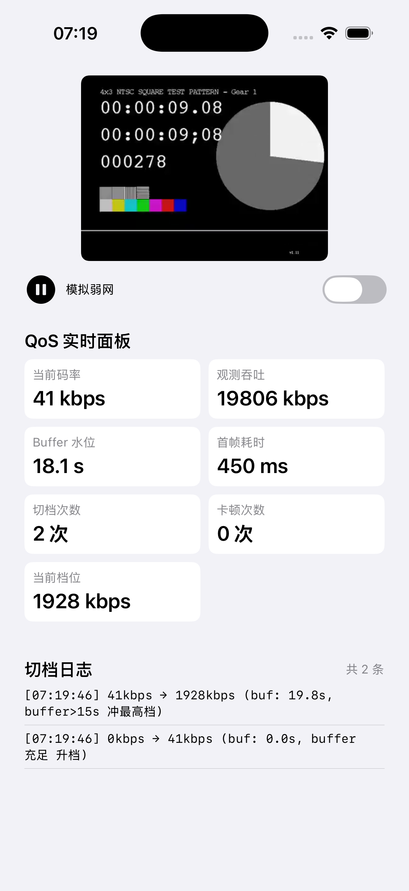
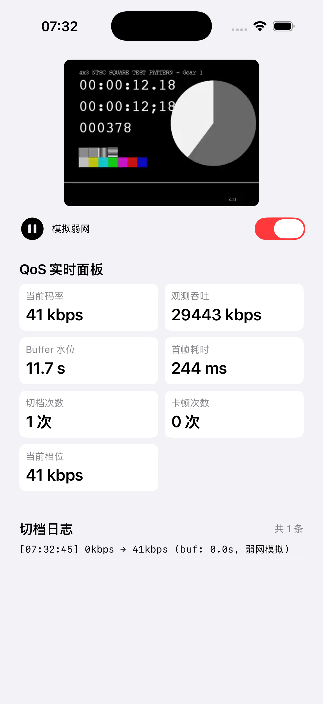

# iOS ABR Player Demo（SPDD 方法论实践）

> 通过 SPDD 方法论（constitution → spec → plan → tasks → implement）开发的一个最小可运行 iOS HLS 播放器 demo，核心功能是**自定义 BBA（Buffer-Based Approach）ABR 算法 + 实时 QoS 监控面板**。

## 项目背景

这是一个用来实践 SPDD（Spec-Driven Development）方法论和端侧 ABR 算法的练手项目。目标是用"先定义 spec、再用 AI 按 spec 生成代码"的方式，在不熟悉的技术栈（iOS / Swift）上快速交付一个可运行的播放器，并验证自定义 BBA 算法和 QoS 监控的端侧落地。

**demo 要证明的三件事**：

1. **能用 SPDD 方法论驱动开发** —— constitution / spec / plan / tasks 文档本身就是交付物
2. **理解 ABR 算法** —— BBA 实现，不是调 AVPlayer 默认
3. **理解 QoS 监控** —— 首帧耗时、buffer 水位、切档次数、卡顿率

## SPDD 流程说明

本项目严格遵循 SPDD（Spec-Driven Development）流程，文档是主交付物，代码是辅交付物：

| 阶段 | 文件 | 作用 |
|---|---|---|
| Constitution | [`.specify/memory/constitution.md`](.specify/memory/constitution.md) | 不可妥协的项目准则（技术栈、延迟预算、ABR 算法约束、QoS 指标、测试纪律） |
| Spec | [`specs/abr-player-demo/spec.md`](specs/abr-player-demo/spec.md) | 需求文档（用户故事、功能/非功能需求、验收标准） |
| Plan | [`specs/abr-player-demo/plan.md`](specs/abr-player-demo/plan.md) | 技术方案（架构、模块设计、数据流、技术决策） |
| Tasks | [`specs/abr-player-demo/tasks.md`](specs/abr-player-demo/tasks.md) | 任务拆解（给 AI 执行的清单） |
| Implement | [`ABRPlayerDemo/`](ABRPlayerDemo/) | Xcode 项目实现 |

**流程纪律**：constitution 是不可妥协的，spec/plan/tasks 任何与之冲突的地方标 CRITICAL；spec 先于 plan，plan 先于 tasks，tasks 先于 implement；implement 阶段发现 spec 不可行时，必须回 spec 修改，不能直接绕过。

## BBA 算法说明

BBA（Buffer-Based Approach）是 SIGCOM 经典论文算法，本 demo 在 AVPlayer 上通过 `preferredPeakBitRate` 近似实现：

```
状态：buffer_seconds（从 loadedTimeRanges 计算）
输入：variants（按 peakBitRate 升序排序）
输出：preferredPeakBitRate（设置给 AVPlayerItem）

参数：
  reservoir = 5s   # 缓冲低于此值，强制最低档（保不卡顿）
  cushion  = 10s  # 缓冲高于 reservoir+cushion=15s，可冲最高档
  hysteresis = 0.8 # 滞回系数，避免频繁切档

决策：
  buffer < reservoir:
    target = variants.min.bitrate        # 安全档
  buffer > reservoir + cushion:
    target = variants.max.bitrate        # 冲最高档
  reservoir <= buffer <= reservoir + cushion:
    ratio = (buffer - reservoir) / cushion
    raw = min + ratio * (max - min)     # 线性插值
    target = quantize(raw, hysteresis=0.8) # 量化到最近档位 + 滞回
```

**对比 AVPlayer 默认**：AVPlayer 的 ABR 是黑盒（苹果不公开算法），我们用 BBA 覆盖它的选择——通过每 0.5 秒检查 buffer 并设置 `preferredPeakBitRate` 来"转向"AVPlayer。这就是"自定义 ABR"在 iOS 上的实现方式。

**滞回设计**：升档保守（buffer 要超过候选档位阈值 × hysteresis 才升）、降档激进（buffer 低于候选档位阈值 / hysteresis 就降），避免在边界频繁切档。

## QoS 指标说明

面板实时显示 7 项指标，覆盖端侧 QoS 体系的关键维度：

| 指标 | 数据来源 | 含义 |
|---|---|---|
| 当前码率 | `accessLog().events.last.indicatedBitrate` | 当前正在播放的码率 |
| 观测吞吐 | `accessLog().events.last.observedBitrate` | 实际下载吞吐估计 |
| Buffer 水位 | `loadedTimeRanges` 末尾 - `currentTime` | 选档的核心依据 |
| 首帧耗时 | 从 `play()` 到 `timeControlStatus==.playing` | 启动延迟 |
| 切档次数 | BBAController 内部计数 | 切档策略是否稳定 |
| 卡顿次数 | `timeControlStatus==.waitingToPlayAtSpecifiedRate` + `reason==.toMinimizeStalls` | QoE 核心指标 |
| 当前档位 | BBA 选择的 variant | ABR 决策可视化 |

## Demo 截图

### 正常网络：BBA 自动升档



- 首帧耗时 450ms（远低于 2s 预算）
- buffer 升到 19.8s 时 BBA 冲到最高档 1928kbps
- 切档日志记录完整决策链：`41kbps → 1928kbps (buf: 19.8s, buffer>15s 冲最高档)`
- 卡顿次数 0

### 模拟弱网：BBA 强制降档



- "模拟弱网"开关开启（红色）
- BBA 强制选最低档 41kbps
- 切档日志原因标记为"弱网模拟"
- 切档次数仅 1 次（降到底就不再切），卡顿次数 0

## 项目结构

```
abr-player-demo/
├── .specify/memory/
│   └── constitution.md          # SPDD 宪法
├── specs/abr-player-demo/
│   ├── spec.md                  # 需求文档
│   ├── plan.md                  # 技术方案
│   └── tasks.md                 # 任务拆解
├── ABRPlayerDemo/               # Xcode 项目
│   ├── ABRPlayerDemo.xcodeproj
│   └── ABRPlayerDemo/
│       ├── ABRPlayerDemoApp.swift       # App 入口
│       ├── ContentView.swift           # 主 UI
│       ├── ABR/
│       │   ├── ABRPlayerController.swift  # AVPlayer 封装
│       │   ├── BBAController.swift        # BBA 算法核心
│       │   ├── HLSVariantParser.swift     # 码率档位解析
│       │   └── QoSObservers.swift         # QoS 指标观察器
│       ├── Models/
│       │   ├── HLSVariant.swift
│       │   ├── QoSMetrics.swift
│       │   └── SwitchLog.swift
│       └── Views/
│           ├── PlayerView.swift          # AVPlayerLayer 包装
│           ├── QoSDashboard.swift        # QoS 实时面板
│           └── SwitchLogView.swift        # 切档日志
├── docs/                        # demo 截图
└── README.md
```

## 如何用 AI 实现（诚实声明）

**Swift 代码是 AI（Cursor / Claude）按我的 spec 生成的，我的核心贡献是 SPDD 文档设计 + BBA 算法设计 + 效果验证 + 参数调优。**

具体分工：
- **我做的**：写 constitution（定义延迟预算、ABR 算法选择、QoS 指标、测试纪律）、写 spec / plan / tasks、设计 BBA 算法和滞回参数、验证效果、调试
- **AI 做的**：按 spec 生成 Swift 代码、生成 pbxproj 工程文件、修复编译错误

这正是 SPDD + AI 的价值——用方法论约束 AI 生成的代码，让不熟悉的技术栈也能快速交付出符合质量标准的结果。

## 运行步骤

1. 打开 `ABRPlayerDemo/ABRPlayerDemo.xcodeproj`
2. 选择 iOS 16+ 模拟器或真机
3. `Cmd+R` 运行
4. app 自动播放 Apple BipBop 多码率测试流
5. 观察 QoS 面板：正常网络下 buffer 逐渐升高，BBA 从最低档升到最高档
6. 打开"模拟弱网"开关：buffer 下降，BBA 降档；关闭后 buffer 恢复，BBA 升档

**弱网测试**：也可用 Xcode → Open Developer Tool → Network Link Conditioner 选择 3G profile，观察 BBA 降档行为。

**自动化弱网验证**：通过环境变量 `ABR_WEAK_NETWORK=1` 启动可默认开启弱网模式（用 `SIMCTL_CHILD_ABR_WEAK_NETWORK=1 xcrun simctl launch <udid> <bundleid>` 在模拟器上注入）。

## 测试流

使用 Apple 官方 BipBop 多码率测试流：
`https://devstreaming-cdn.apple.com/videos/streaming/examples/bipbop_4x3/bipbop_4x3_variant.m3u8`

## 技术栈

- Swift 5.9+ / SwiftUI / AVFoundation
- iOS 16+（需要 `AVURLAsset.load(.variants)` 异步 API）
- 纯原生实现，无任何第三方依赖
