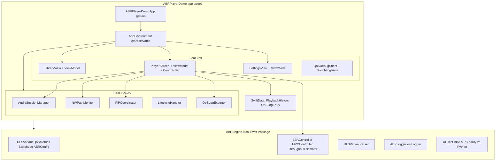

# Plan：iOS ABR Player Demo 技术方案

> 基于 `spec.md` 定义的技术实现方案。本文档定义"怎么做"。
>
> v2.0：客户端化重构。iOS 17+ / `@Observable` / `SwiftData` / `NavigationStack`；ABREngine 抽成本地 Swift Package；QoS 改为调试 sheet；新增音频会话/PiP/AirPlay/生命周期/网络监控/错误 UI/CSV 导出/XCTest。

## 1. 架构总览

三层结构：app target（UI + 基础设施）→ 本地 Swift Package `ABREngine`（算法核心）→ XCTest（守对齐）。



## 2. 模块设计

### 2.1 ABREngine（`Packages/ABREngine/`，本地 Swift Package）

**职责**：ABR 算法核心，可独立于 app 被 XCTest 验证。

- `Sources/ABREngine/Models/`
  - `HLSVariant.swift` / `QoSMetrics.swift` / `SwitchLog.swift`（从 app 移入）
  - `ABRConfig.swift`（新增）：把 reservoir/cushion/hysteresis/w_stall/w_quality/w_switch/alpha/mpc_dt/horizon 打包成 struct，由 Settings 注入，替代各控制器内的硬编码 `let`
- `Sources/ABREngine/Policies/`
  - `ABRController.swift`（protocol，从 app 移入）
  - `BBAController.swift` / `MPCController.swift` / `ThroughputEstimator.swift`（从 app 移入，改造为接收 `ABRConfig`）
- `Sources/ABREngine/Parser/HLSVariantParser.swift`（从 app 移入）
- `Sources/ABREngine/Logging/ABRLogger.swift`（新增）：`os.Logger` 封装，按 subsystem `com.abrplayer.demo.engine` 分通道
- `Tests/ABREngineTests/`：BBA/MPC parity 测试（见 §4）

**关键 API**（对外）：
- `public protocol ABRController`：`currentTarget` / `switchCount` / `simulateWeakNetwork` / `onSwitch` / `variants` / `start()` / `stop()`
- `public struct ABRConfig`：所有可调参数
- `public enum HLSVariantParser`：`static func parse(from:) async throws -> [HLSVariant]`

### 2.2 App 层（`ABRPlayerDemo/ABRPlayerDemo/`）

#### App/
- `ABRPlayerDemoApp.swift`：`@main`，创建 `AppEnvironment` 注入 `Environment`
- `AppEnvironment.swift`：`@Observable` 依赖容器，持有 `SettingsStore` / `StreamLibrary` / SwiftData `ModelContainer`
- `SettingsStore.swift`：`@AppStorage` 包装所有 Settings 标量（strategy、reservoir、cushion、hysteresis、w_stall、w_quality、w_switch、weakNetwork、autoWeakOnCellular、debugPanelVisible、qosLoggingEnabled）
- `StreamLibrary.swift`：内置流列表 + SwiftData 持久化的最近播放

#### Features/Library/
- `LibraryView.swift` + `LibraryViewModel.swift` + `StreamRow.swift`：`NavigationStack` + `List`，tap 推到 PlayerScreen

#### Features/Player/
- `PlayerScreen.swift`：替代旧 ContentView，全屏播放 + 控制条 + 调试 sheet 入口 + 错误 overlay
- `PlayerViewModel.swift`：`@Observable`，拆自旧 `ABRPlayerController`，只管 AVPlayer + ABREngine 的 ABRController + QoS 采样写入 SwiftData
- `PlayerControlsBar.swift`：play/pause、scrubber + 时间标签、PiP 按钮、`AVRoutePickerView`(AirPlay)、策略 picker
- `PlayerView.swift`：保留现有 `UIViewRepresentable` + `AVPlayerLayer`，加 PiP 兼容（暴露 layer 引用给 `PiPCoordinator`）
- `QoSDebugSheet.swift`：移自 `Views/QoSDashboard.swift`，作为 sheet 呈现，含 7 项指标 + 切档日志入口

#### Features/Settings/
- `SettingsView.swift` + `SettingsViewModel.swift`：参数 sliders、策略选择、弱网开关、CSV 导出按钮、清空历史

#### Features/Logs/
- `SwitchLogView.swift`（移自 `Views/`）：sheet 内组件

#### Infrastructure/
- `AudioSessionManager.swift`：`.playback` category，监听 `interruptionNotification` / `routeChangeNotification`
- `NetworkMonitor.swift`：`NWPathMonitor`，暴露 WiFi/cellular/none
- `PiPCoordinator.swift`：`AVPictureInPictureController` 生命周期，与 `PlayerUIView` 的 `AVPlayerLayer` 绑定
- `LifecycleHandler.swift`：`scenePhase` → 后台暂停（PiP 激活时除外）、QoS 采样暂停/恢复
- `QoSLogExporter.swift`：从 SwiftData 读 `QoSLogEntry`，写 CSV 到 tmp，`ShareLink` 导出

#### Resources/
- `Info.plist`：`UIBackgroundModes = [audio]`、`AVPictureInPictureController` 配置

### 2.3 SwiftData 模型

- `PlaybackHistoryItem`：`url: URL`、`title: String`、`lastPosition: Double`、`lastPlayedAt: Date`
- `QoSLogEntry`：`sessionID: UUID`、`timestamp: Date`、`bufferSeconds: Double`、`currentBitrate: Double`、`observedBitrate: Double`、`targetBitrate: Double`、`switchCount: Int`、`stallCount: Int`

## 3. 数据流

```
AVPlayer (播放)
   ↓ loadedTimeRanges (KVO)
PlayerViewModel → QoSMetrics.bufferSeconds
   ↓ 每 0.5s
ABREngine.BBAController.decide(bufferSeconds, config) → targetBitrate
   ↓
AVPlayerItem.preferredPeakBitRate = targetBitrate
   ↓
AVPlayer 响应新码率 → accessLog 更新
   ↓ NSNotification
PlayerViewModel → QoSMetrics.currentBitrate
   ↓ @Observable
SwiftUI View 自动刷新
   ↓ 每 0.5s（调试模式）
SwiftData QoSLogEntry 写入
```

## 4. 关键技术决策

### 4.1 为什么用 `@Observable`（iOS 17+）而不是 `ObservableObject`
- `@Observable` 不需要 `@Published` 标注，按属性访问自动追踪，代码更简洁
- 与 `SwiftData` 的 `@Model` 一致，状态管理范式统一
- 项目已 bump 到 iOS 17+，没有兼容负担

### 4.2 为什么把 ABREngine 抽成本地 Swift Package
- 算法可在不启动 app 的情况下被 XCTest 验证——守 constitution §5 的"逐行对齐"纪律
- 镜像真实生产项目的模块化：算法核心与 UI/基础设施分离，可独立演进
- `ABRConfig` 注入让 Settings 调参与离线搜参结果写回有统一入口

### 4.3 为什么 QoS 改为调试 sheet
- constitution §4 要求"实时显示"但未要求"常驻主屏"
- 真实 app 都把 QoS 面板藏在调试入口后；常驻主屏是 demo 习惯
- 指标仍按 0.5s 实时更新，只是默认不可见

### 4.4 为什么用 SwiftData 而不是 UserDefaults / 文件
- 播放历史与 QoS 采样是结构化数据，SwiftData 比 UserDefaults 更合适
- QoS 采样量大，需要查询/截断，SwiftData 的谓词查询比文件解析高效
- iOS 17+ 原生支持，无第三方依赖

### 4.5 为什么用 `preferredPeakBitRate` 而不是替换 AVPlayerItem
- `preferredPeakBitRate` 是官方 API，设置后 AVPlayer 会优先选择不超过此值的最高档位
- 替换 AVPlayerItem 会触发重新加载、首帧延迟，不适合 0.5s 一次的控制循环
- 这是 iOS 上实现自定义 ABR 的标准方式

## 5. 风险与应对

| 风险 | 应对 |
|---|---|
| 本地 Swift Package 的 pbxproj 生成复杂 | 先按包做；若 `XCLocalSwiftPackageReference` 段生成有误，回退为 app 内 `Engine/` 目录组 + 独立 `ABREngineTests` test target |
| PiP 在模拟器不可用 | spec 注明验收需真机；模拟器构建不报错即可 |
| SwiftData QoS 采样累积过多 | 仅调试模式写入 + 自动截断到最近 N 条 |
| 对齐测试期望值维护成本 | 改 `simulate_abr.py` 策略逻辑时必须同步重生成期望值；约定写入 tasks |

## 6. 实施顺序

见 `tasks.md`。按文档先行 → ABREngine Package → 测试 → pbxproj → App 骨架 → Player → Settings → 持久化 → 音频/PiP/网络 → 导出/错误 → README 的顺序推进。
